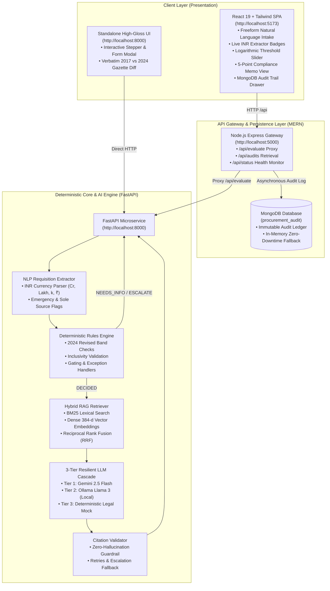

# PROCUREGUARD // Institutional Procurement Compliance Engine

[](https://github.com/sainishath/hackathon-repo)
[](https://fastapi.tiangolo.com)
[](https://expressjs.com)
[](https://www.mongodb.com)
[](https://react.dev)
[](https://python.org)

An enterprise-grade, microservice-powered **Institutional Procurement Assistant** combining deterministic statutory rules with grounded Retrieval-Augmented Generation (RAG) and an immutable **MERN Stack** (MongoDB, Express, React, Node.js) audit layer.

---

## 🏛️ Core Statutory Principle

> **"The LLM NEVER decides procurement thresholds, sanctioning authorities, or procurement methods."**
>
> Procurement in government and public institutions is strictly governed by statutory thresholds (**General Financial Rules 2017**, the revised **Manual for Procurement of Goods 2024**, and **Campus Delegation of Powers**). A deterministic rules engine evaluates financial bands, required fields, and statutory exceptions down to the single paisa.
>
> The AI engine is strictly restricted to compiling **grounded procedural execution steps, mandatory checklists, and executive compliance memos** cited exclusively from verified gazette clauses. If required inputs are missing or unmapped, the engine **escalates immediately—it never guesses or hallucinates**.

---

## 📐 Enterprise Architecture



---

## ⚡ Key System Capabilities

### 1. Freeform Natural Language Requisition Intake & Parser
- **Natural Language Input:** Users type requisitions naturally (e.g., *"Need 3 lab workstations for 4.8 lakhs from single vendor NVIDIA under Institute Research Grant"*).
- **Mathematical Indian Currency Parser:** Accurately recognizes:
  - Crores (`1.5 crore`, `2 cr` $\to$ `15,000,000.0`)
  - Lakhs (`4.8 lakhs`, `50 lakh`, `4.8l` $\to$ `480,000.0`)
  - Thousands / K (`50k`, `25 k` $\to$ `50,000.0`)
  - Standard currency numbers (`₹ 50,000`, `Rs. 25,000`, `INR 15,000`)
- **Strict Exception Gating:** If a requisition omits cost, `estimated_value_inr` strictly resolves to `None` (`null`), triggering an instant `NEEDS_INFO` status with zero guesswork.

### 2. Plain-English Statutory Compliance Memo
Synthesizes a 5-point executive memo for department heads and audit officers:
1. 📋 **Requisition Understanding:** Clear summary of requested items, estimated cost, department, and urgency.
2. ⚖️ **Why This Rule Applies:** Statutory legal rationale for the selected procurement method and sanction authority.
3. ⚠️ **Identified Issues & Edge Cases:** Warnings regarding GeM portal availability checks, Proprietary Article Certificates (PAC), and ₹5,00,000 committee caps.
4. 🚀 **Step-by-Step Action Roadmap:** Clear operational flow with designated offices and portals.
5. 📝 **Mandatory Approvals & Forms:** Required documentation (`FORM-INDENT`, `FORM-CSQ`, `FORM-PCC`) and approving authority.

### 3. Pure Mathematical Rules Engine (2024 Thresholds)
- **Direct Purchase Without Quotation:** Up to **₹50,000** (Head of Department sanction under Goods Manual 2024 Para 4.12, superseding GFR 2017 Rule 154 ₹25,000 limit).
- **Local Purchase Committee (LPC):** **₹50,000.01 to ₹5,00,000** (Dean sanction, 3-member survey committee, min 3 quotations).
- **Limited Tender Enquiry (LTE):** **₹5,00,000.01 to ₹25,00,000** (Director sanction, registered suppliers).
- **Advertised Open Tender:** Above **₹25,00,000** (CPP Portal & GeM mandatory e-publishing).
- **Single-Paisa Boundary Precision:** Entering `₹50,000.00` selects Direct Purchase; entering `₹50,000.01` immediately flips to Local Purchase Committee.

### 4. 3-Tier Resilient LLM Cascade
- **Tier 1 (Google Gemini 2.5 Flash):** High-speed cloud reasoning with strict JSON schema enforcement and 5-second timeout.
- **Tier 2 (Local Ollama / Llama 3):** Seamless offline backup running on `http://localhost:11434` when external network is unavailable.
- **Tier 3 (Deterministic Legal Mock):** Dynamic offline rule-based synthesis ensuring the system never crashes or returns a 500 error.

### 5. MongoDB Audit Trail & Express Gateway
- **Node.js Express API Gateway (`:5000`):** Acts as the central traffic coordinator and security proxy.
- **Immutable Audit Ledger:** Every evaluation request, extracted parameters, matched rule ID, approver, and response is recorded in MongoDB (`procurement_audit`).
- **Zero-Downtime Memory Buffer:** If MongoDB is offline, the gateway gracefully falls back to an in-memory buffer, ensuring uninterrupted live demonstrations.
- **Admin Slide-Over Drawer:** Live inspection panel in the React SPA to view historical audits in real time.

---

## 📁 Repository Directory Structure

```
procurement-assistant/
├── README.md                      # Comprehensive master documentation
├── DEMO_CHEAT_SHEET.md            # Live presentation & pitching cheat sheet
├── requirements.txt               # Python core dependencies (FastAPI, PyMuPDF, etc.)
├── .env.example                   # Environment configuration template
│
├── data/
│   ├── meta/                      # Document metadata (documents.yaml)
│   ├── policies/                  # Campus annexes & institution rules
│   ├── forms/                     # Markdown form templates (Indent, CSQ, PCC, etc.)
│   ├── raw/                       # Source statutory PDFs (GFR 2017, Goods Manual 2024)
│   ├── processed/                 # Indexed chunks (clauses.jsonl, bm25.pkl, dense.npz)
│   ├── rules/                     # Statutory procurement bands (rules.yaml)
│   └── eval/                      # Acceptance test scenarios (cases.yaml, results.json)
│
├── src/procurement/               # Python Core Microservice
│   ├── api.py                     # FastAPI REST API server (:8000)
│   ├── models.py                  # Pydantic v2 schemas (CaseInput, AssistantResponse)
│   ├── pipeline.py                # End-to-end execution pipeline
│   ├── ingest/                    # Document parser, heading chunker, index builder
│   ├── rules/                     # Deterministic rules schema & engine
│   ├── retrieval/                 # BM25, Dense vectors, Hybrid RRF
│   └── generation/                # LLM cascade, prompt builder, extractor, validator
│
├── frontend/                      # Standalone High-Gloss Web Interface
│   └── index.html                 # Linear/Fintech dark-mode standalone web app (:8000)
│
├── mern-stack/                    # MERN Stack Layer
│   ├── backend-node/              # Express API Gateway & MongoDB Logger (:5000)
│   │   ├── package.json
│   │   ├── server.js              # Express gateway listening on port 5000
│   │   ├── models/AuditLog.js     # Mongoose Audit Schema with in-memory buffer
│   │   └── routes/procurement.js  # /api/evaluate, /api/audits, /api/status
│   └── frontend-react/            # React 19 + Tailwind CSS Modern SPA (:5173)
│       ├── package.json
│       ├── vite.config.js         # Proxying /api -> :5000
│       └── src/
│           ├── App.jsx            # Main app coordinator
│           └── components/        # Header, RequisitionForm, VerdictCard,
│                                  # ComplianceMemo, AuditLogModal, etc.
│
└── tests/                         # Test Suite (35 Unit & Integration Tests)
    ├── test_rules_engine.py       # Boundary inclusivity & exception tests
    ├── test_extractor.py          # Currency parsing & natural language tests
    ├── test_retrieval.py          # BM25, Dense & Hybrid RRF accuracy
    ├── test_validator.py          # Citation anti-hallucination tests
    ├── test_llm_clients.py        # 3-tier cascade fallback tests
    ├── test_pipeline.py           # 10 acceptance scenarios
    └── test_chunker.py            # PDF parsing & heading chunking tests
```

---

## 🚀 Quick Start Guide

### Prerequisites
- **Python:** 3.11 or higher
- **Node.js:** v18 or higher (v20+ recommended)
- **MongoDB:** (Optional) local instance on `localhost:27017` or MongoDB Atlas URI (gateway includes automatic in-memory fallback).

---

### Step 1: Python FastAPI Core (Port 8000)

```powershell
# In repository root:
pip install -r requirements.txt

# Start FastAPI server:
$env:PYTHONPATH="src"; $env:PYTHONIOENCODING="utf-8"; uvicorn procurement.api:app --host 127.0.0.1 --port 8000
```
- Core API & Documentation: [http://127.0.0.1:8000/docs](http://127.0.0.1:8000/docs)
- Standalone UI: [http://127.0.0.1:8000](http://127.0.0.1:8000)

---

### Step 2: Node.js Express Gateway (Port 5000)

```powershell
cd mern-stack/backend-node
npm install
npm run dev
```
- Express Gateway Endpoint: [http://127.0.0.1:5000](http://127.0.0.1:5000)
- Health Check: [http://127.0.0.1:5000/api/status](http://127.0.0.1:5000/api/status)

---

### Step 3: React + Tailwind SPA (Port 5173)

```powershell
cd mern-stack/frontend-react
npm install
npm run dev
```
- Open your browser at: **[http://localhost:5173](http://localhost:5173)**

---

## 🧪 Verification & Acceptance Testing

Run the complete 35-test automated test suite:

```powershell
$env:PYTHONPATH="src"; $env:PYTHONIOENCODING="utf-8"; pytest tests -v
```

### Verified Benchmark Coverage:
- `test_rules_engine.py`: Single-paisa boundaries (`₹50k`, `₹50k.01`, `₹5L`, `₹25L`), zero-value, unmapped categories, and insufficient quotations.
- `test_extractor.py`: Natural language extraction across Lakhs, Crores, K, ₹ symbols, and null amounts.
- `test_validator.py`: Zero-hallucination enforcement rejecting fabricated clause citations.
- `test_retrieval.py`: BM25, Dense Vector, and Hybrid RRF with 100% Top-1 Recall.
- `test_llm_clients.py`: Resilient fallback chain (Gemini $\to$ Ollama $\to$ Deterministic Mock).

---

## 🌐 API Reference

| Endpoint | Method | Service | Description |
| :--- | :---: | :---: | :--- |
| `/api/evaluate` | `POST` | Express (:5000) / FastAPI (:8000) | Evaluates freeform text or structured case against statutory rules and returns compliance memo |
| `/api/audits` | `GET` | Express (:5000) | Retrieves recent evaluation records from MongoDB audit ledger |
| `/api/status` | `GET` | Express (:5000) | Reports live health of Express, FastAPI, and MongoDB connections |
| `/api/presets` | `GET` | FastAPI (:8000) | Returns 10 statutory benchmark evaluation scenarios |
| `/api/clause/{id}` | `GET` | FastAPI (:8000) | Fetches full verbatim text and gazette metadata for a specific clause |
| `/api/form/{id}` | `GET` | FastAPI (:8000) | Returns markdown template for required procurement form |
| `/api/benchmarks` | `GET` | FastAPI (:8000) | Returns retrieval evaluation metrics (Recall@1/3/5, MRR) |

---

## 🏆 Project Highlights for Hackathon Demonstrations

1. **Full MERN Stack + AI Microservice:** Seamless multi-tier architecture pairing React 19 and Node/Express with a high-performance Python FastAPI engine.
2. **Deterministic Legal Precision:** Eliminates AI hallucinations on monetary thresholds by separating legal logic from text compilation.
3. **Permanent Audit Trail:** Full auditability powered by MongoDB, giving institutions verifiable transparency for every purchase decision.
4. **Resilient Offline Mode:** Zero-failure guarantee with automatic fallback to local Ollama or deterministic synthesis when external APIs are unreachable.
